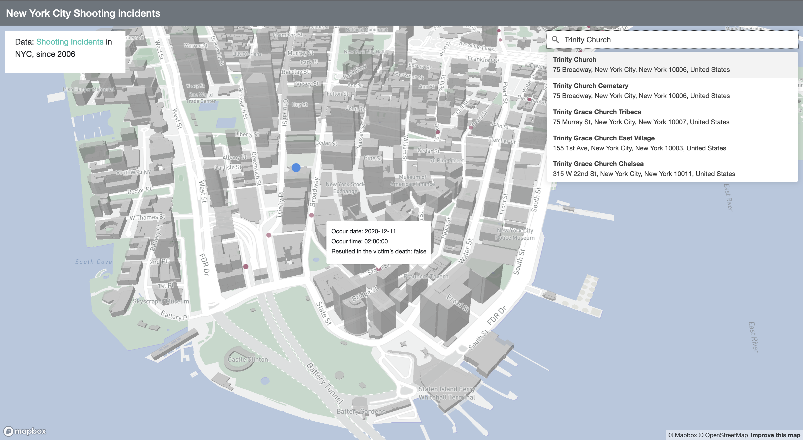

# NYC-Shooting-Incidents
## Description:
This is a breakdown of every shooting incident that occurred in NYC going back to 2006 through the end of the previous calendar year. This data is manually extracted and reviewed by the Office of Management Analysis and Planning before being posted on the NYPD website. One of the main function and purpose of this map is to get a better understanding of the shooting incidents that has already happen around them in the neighborhood by put down their own addresses. Thus, more people could address what we know about gun violence around them and prevents it from occurring in the first place.
## Goal:
The goal of this project is to inform all the shooting incidents that happen around them before so they could have a more comprehensive understanding about the safety situation in their neighbour. An Active Shooter is an individual actively engaged in killing or attempting to kill people in a confined and populated area; in most cases, active shooters use firearm and there is no pattern or method to their selection of victims. Sometimes, active shooter situations are unpredictable and evolve quickly. Typically, the immediate deployment of law enforcement is required to stop the shooting and mitigate harm to victims. But with an application like this, people can check their surrounding safty level through past incidents by themself and make safer decisions. 
## Application URL:
https://zhiyuan-jiao.github.io/NYC-Shooting-Incidents/
## Screenshot:

## Main Function:
There are two main functions in this web application. Firstly, all the incidents that happened since 2016 is display in the customed map with a 3D view. The user could hover over each single venue in the map to view the pop-up with more detailed information about the shooting incident including the date, time occurred, and if it resulted in the victim's death. Another main function of this web application is local search. It is easy to notice that there is a search bar on the top right corner of the screen, the user could type in the location they want to search for and choose the one that is the closest to locate the map to that area to get a better understanding of the safety situation in that neighbour.
## Data Source:
The data source of this web application is retrieved from [NYC Open Data](https://data.cityofnewyork.us/Public-Safety/NYPD-Shooting-Incident-Data-Historic-/833y-fsy8). It includes a list of every shooting incident that occurred in NYC going back to 2006 through the end of the previous calendar year. It is a breakdown of every shooting incident that occurred in NYC going back to 2006 through the end of the previous calendar year. Their data is manually extracted every quarter and reviewed by the Office of Management Analysis and Planning before being posted on the NYPD website. Each record represents a shooting incident in NYC and includes information about the event, the location and time of occurrence. In addition, information related to suspect and victim demographics is also included in it. 
## Applied libraries and Web Services in use:
Most of the libraries applied in this web application is from Mapbox GL including the Javascript and CSS files. Also, I included the Mapbox geocoder library to make the local search feature come true. In addition, I imported the Bootstrap libraries with templates to make the web application more interactive and responsive. 
## Acknowledgment:
I really appreciate the technical guidance from my instructor Dr. Zhao and TA Steve Bao. Also, It won't be as good as it is right now without the feedbacks from my classmates in GEOG495. That you all so much! 
